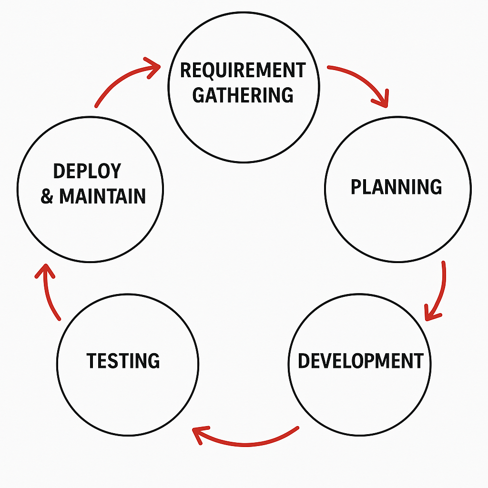

# Software Development Life Cycle (SDLC)

The **Software Development Life Cycle (SDLC)** is a well-defined process that outlines the steps involved in developing software. Below is a detailed explanation of each phase:

---

## 1. Requirement Gathering & Analysis
- **Purpose**: Understand what the product needs to do.
- **Activities**:
  - Identify **product features**: What the software will offer.
  - Understand **users**: Who will use the software and how.
  - Analyze **usage scenarios**: How the software will be used in real-world situations.
  - Gather **user requirements**: What users expect from the software.
  - Study the **market state**: Competitors, trends, and opportunities.
- **Outcome**: A clear set of requirements documented for the next phases.

---

## 2. Planning
- **Purpose**: Create a roadmap for development.
- **Activities**:
  - Estimate **cost**: Budget for development, testing, and deployment.
  - Allocate **resources**: Assign team members, tools, and infrastructure.
  - Assess **risks**: Identify potential challenges and plan mitigation strategies.
- **Outcome**: A project plan that guides the team.

---

## 3. Design Architecture
- **Purpose**: Define how the software will work.
- **Activities**:
  - Translate **requirements** into a technical design.
  - Create **system architecture**: High-level structure of the software.
  - Design **detailed components**: Database schema, APIs, user interfaces, etc.
- **Outcome**: A blueprint for developers to follow.

---

## 4. Development Phase
- **Purpose**: Build the software.
- **Activities**:
  - Write code based on the design.
  - Implement features and functionality.
  - Perform unit testing to ensure individual components work correctly.
- **Outcome**: A working version of the software.

---

## 5. Testing (Quality Assurance)
- **Purpose**: Ensure the software is reliable and meets requirements.
- **Activities**:
  - Perform **functional testing**: Verify features work as expected.
  - Conduct **performance testing**: Ensure the software performs well under load.
  - Fix bugs and retest.
- **Outcome**: A stable and bug-free product.

---

## 6. Deployment
- **Purpose**: Make the software available to users.
- **Activities**:
  - Deploy the software to production environments.
  - Ensure the system is running smoothly.
  - Provide user training if needed.
- **Outcome**: The software is live and operational.

---

## 7. Maintenance
- **Purpose**: Keep the software running and up-to-date.
- **Activities**:
  - Apply **changes**: Add new features or modify existing ones.
  - Ensure **uptime**: Fix issues quickly to minimize downtime.
  - Monitor performance and user feedback.
- **Outcome**: A continuously improved and reliable product.

---

## SDLC Process Diagram

Below is a visual representation of the SDLC process:

---

This process is often iterative, meaning steps like testing and development may repeat as new requirements or issues arise. It ensures the software evolves to meet user needs and market demands.